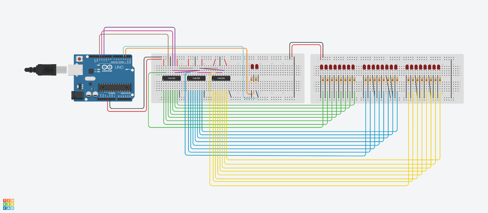
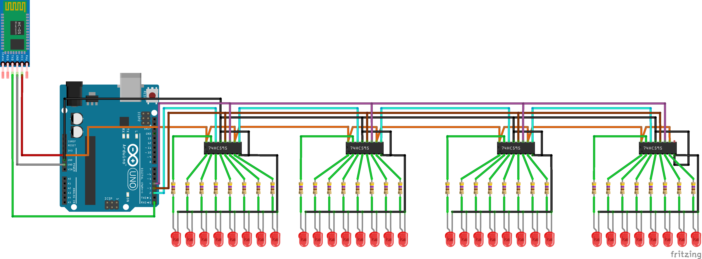

# Painel Stranger Things
UNIVERSIDADE FEDERAL DO ESPIRITO SANTO
ENGENHARIA DE COMPUTAÇÃO
PROJETO INTEGRADOR I
## Grupo

Athila Archanji Rodrigues

Bernardo Vargens Broedel

## Resumo

Com o objetivo de aplicar os conhecimentos adquiridos durante a disciplina de Projeto Integrador I, foi desenvolvido pelos alunos Athila e Bernardo, um projeto que recebe uma mensagem do usuario atraves de um aplicativo de celular, que com o auxilio do Modulo Bluetooth, envia para o arduino que é responsavel por acender determinados LED's de acordo com as letras da mensagem enviada.

## Materiais

- 1 Arduino UNO
- 1 Módulo Bluetooth HC-05
- 3 Circuito integrado 74HC595
- 26 Resistores 470 Ohm
- 26 LED's variados
- Jumpers Macho Macho
- Jumpers Macho Femea

## Esquemático

## Codigo

Codigo do arduino pode ser acessado dentro da pasta 'SRC' com nome de 'prog.ino'

## Aplicativo

O aplicativo pode ser acessado dentro da pasta 'SRC' com nome de 'aplicativo.aia'

## Utilizar

Para testar o projeto, basta seguir os passos demonstrados no video

## Video

https://www.youtube.com/watch?v=e4kC7BBC4oI

## 74HC595

Ele é um circuito integrado, para adicionar 8 portas a cada circuito integrado a partir de 3 portas

## MONTAGEM

