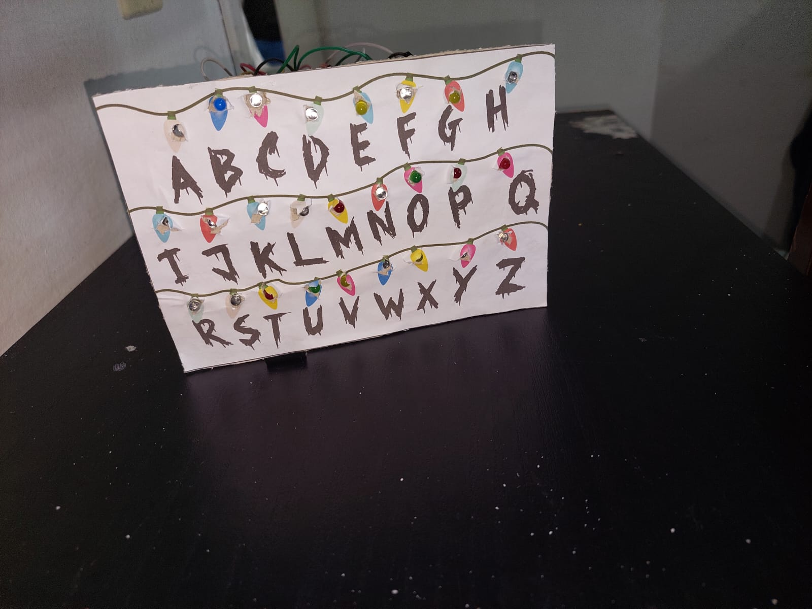

# Painel Stranger Things
UNIVERSIDADE FEDERAL DO ESPIRITO SANTO
ENGENHARIA DE COMPUTAÇÃO
PROJETO INTEGRADOR I
## Grupo

Athila Archanji Rodrigues

Bernardo Vargens Broedel

## Resumo

Com o objetivo de aplicar os conhecimentos adquiridos durante a disciplina de Projeto Integrador I, foi desenvolvido pelos alunos Athila e Bernardo, um projeto que recebe uma mensagem do usuario atraves de um aplicativo de celular, que com o auxilio do Modulo Bluetooth, envia para o arduino que é responsavel por acender determinados LED's de acordo com as letras da mensagem enviada.

## Descrição

Aplicando os conhecimentos adquiridos durante a disciplina de Projeto Integrador I, foi desenvolvido pelos alunos Athila e Bernardo, um projeto que ao receber uma mensagem do usuario atraves de um aplicativo de celular, faz piscar os LED, que estão no painel, de cada letra da mensagem enviada.

Cada LED é controlado atraves das portas, como existem 2 letras no alfabeto, foi preciso pensar em uma maneira de ampliar essas portas. Com o auxilio do circuito integrado 74HC595, que a partir de 3 portas, consegue expandir para 8 portas, ou seja, a cada circuito integrado, utilizando apenas 3 portas do Arduino Uno, conseguimos expandir para 8.
Utilizamos 3 circuitos integrados 74HC595, para que, a partir dessas 3 portas, expandimos para 24 portas, que foram controladas de forma individual.

Funcionando como uma matriz. No codigo, para acessar a porta logica, enviamos o valor da porta. Por exemplo, para acessar a primeira porta na ordem, enviamos (128,0,0) com isso recebemos a 'coordenada' daquela porta.

Para as outras portas, segue o mesmo padrão. Começando em 128, e sempre dividindo por 2, ate chegar no 1. com isso temos 8 portas. 128,64,32,16,84,8,2,1. Para acessar os outros circuitos integrados, basta mudar a posição. Por exemplo, (0,128,0) e assim por diante.

Com isso, montamos um sistema de IF e ELSE para manipular essas portas. Restando 2 letras para controlar todas as 26 letras do alfabeto, e como são apenas duas que falta, utilizamos 2 portas diretamente do arduino para isso.

E para receber a mensagem do usuario, utilizamos do Modulo Bluetooth HC-05. Com isso, desenvolvemos tambem um aplicativo simples feito no APP Inventor, mas tambem funcionaria com aplicativos ja prontos que possuam um terminal Bluetooth.

A maior dificuldade se deu na pratica, foram muitos Jumpers utilizados, e para facilitar, utilizamos 2 protoboards para realizar as ligações de maneira mais simples.

## Materiais

- 1 Arduino UNO
- 1 Módulo Bluetooth HC-05
- 3 Circuito integrado 74HC595
- 2 Protoboards
- 26 Resistores 470 Ohm
- 26 LED's variados
- Jumpers Macho Macho
- Jumpers Macho Femea

## Esquemático

## Codigo

Codigo do arduino pode ser acessado dentro da pasta 'SRC' com nome de 'prog.ino'

## Aplicativo

O aplicativo pode ser acessado dentro da pasta 'SRC' com nome de 'aplicativo.aia'

## Utilizar

Para testar o projeto, basta seguir os passos demonstrados no video

## Video

https://www.youtube.com/watch?v=e4kC7BBC4oI

## 74HC595

Ele é um circuito integrado, para adicionar 8 portas a cada circuito integrado a partir de 3 portas

## MONTAGEM

